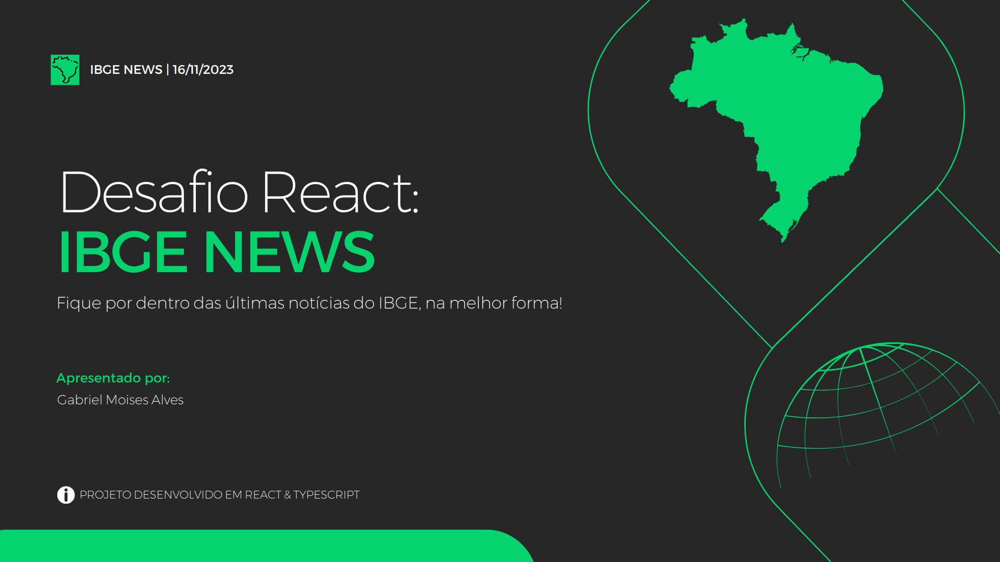

# 🥇 Desafio React - Trybe 

  
Tabela de tópicos

  <ol>
    <li><a href="#sobre">Sobre</a>
    <li><a href="#classificação">Classificação</a></li>
    <li>
      <a href="#apresentação">Apresentação</a>
      <ul>
        <li><a href="#live-completa">Live completa</a></li>
        <li><a href="#apresentação-do-projeto">Apresentação do projeto</a></li>
    </li>
  </ol>

## Sobre

Este projeto foi desenvolvido como solução de um desafio técnico de React, após a formação em Front-End na Trybe. O desafio consistia em desenvolver uma aplicação web de notícias do IBGE, sendo avaliado com os seguintes critérios:

- Boas práticas de desenvolvimento como: html semântico, componentização, design patterns, clean code.
- Domínio das ferramentas e linguagens que compõe um app de frontend moderno.
- Documentação: explicação para construir o app localmente, histórico e workflow de git.
- Muito mais...

## Classificação

Com a avaliação técnica dos projetos na turma, o IBGE NEWS foi finalista top 3 e classificado para apresentação final. Após a apresentação, o projeto foi votado e escolhido como **vencedor** do desafio. 🏆

## Apresentação

O projeto foi apresentado em uma live e está disponível no YouTube:

### [Live completa](https://www.youtube.com/live/c6NiGlRtB0U?si=lrK7fNbDPsbn_u6b)

### [Apresentação do projeto](https://www.youtube.com/live/c6NiGlRtB0U?si=zCrdBV5DN4_d0lHB&t=1358)

