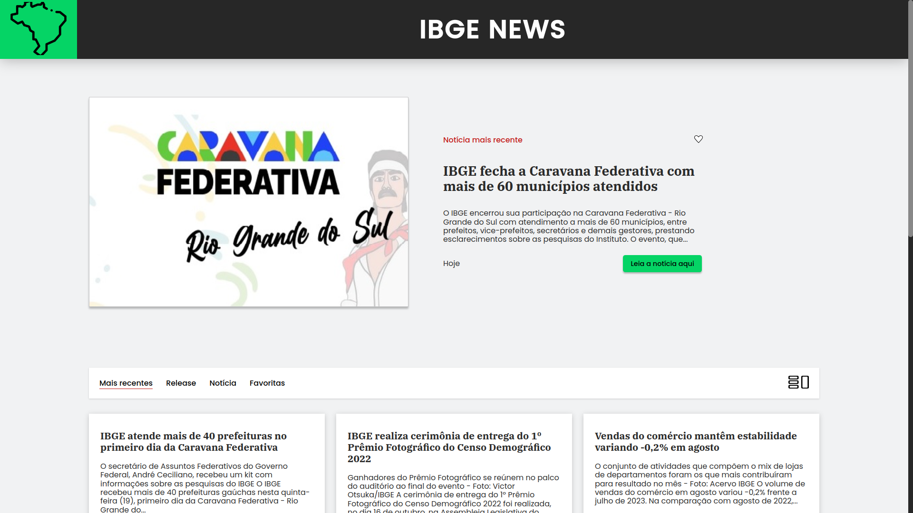
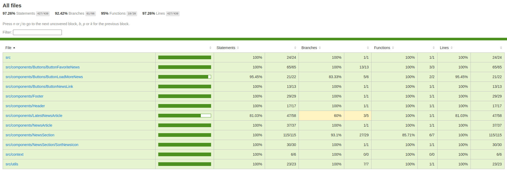

<br />
<div align="center">
  <a href="https://github.com/othneildrew/Best-README-Template">
    
  </a>

  <h3 align="center">IBGE News</h3>

  <p align="center">
    Fique por dentro das últimas notícias do IBGE, na melhor forma!
    <br />
    <br />
    <a href="https://gabrielmoisesa.github.io/challenge-ibge-news">Demo</a>
    ·
    <a href="https://github.com/gabrielmoisesa/challenge-ibge-news/blob/main/README.md">Documentação</a>
    ·
    <a href="https://github.com/gabrielmoisesa">Autor</a>
  </p>
</div>

<details>
  <summary>Tabela de tópicos</summary>
  <ol>
    <li>
      <a href="#sobre-o-projeto">Sobre o projeto</a>
      <ul>
        <li><a href="#principais-features">Principais Features</a></li>
        <li><a href="#tecnologiasferramentas-utilizadas">Tecnologias/Ferramentas utilizadas</a></li>
        <li><a href="#porque-a-escolha-dessas-tecnologiasferramentas">Porque a escolha dessas tecnologias/ferramentas?</a></li>
      </ul>
    </li>
    <li>
      <a href="#como-rodar-a-aplicação">Como rodar a aplicação</a>
      <ul>
        <li><a href="#pré-requisitos">Pré-requisitos</a></li>
        <li><a href="#passos-de-instalação">Passos de Instalação</a></li>
      </ul>
    </li>
    <li><a href="#resultado---deploy">Resultado - Deploy</a></li>
    <li><a href="#licença">Licença</a></li>
    <li><a href="#autor">Autor</a></li>
  </ol>
</details>

## Sobre o projeto



> IBGE News é um projeto que foi desenvolvido como solução de um desafio técnico de React

Essa é uma aplicação Web de páginas de notícias do [IBGE](https://pt.wikipedia.org/wiki/Instituto_Brasileiro_de_Geografia_e_Estat%C3%ADstica) (Instituto Brasileiro de Geografia e Estatística) que são obtidas através de sua [API de Notícias](https://servicodados.ibge.gov.br/api/docs/noticias?versao=3) oficial.

O objetivo da aplicação com a obtenção das notícias é disponibilizar, organizar, filtrar e informar sobre as últimas notícias do IBGE de forma simples e intuitiva, com uma experiência de usuário agradável e responsiva.

### Principais Features
* Notícias recentes sempre atualizadas, obtidas de uma **API**
* Design **responsivo** em qualquer dispositivo
* Filtragem de notícias, por: Mais Recentes, Release, notícia e favoritas
* Funcionalidade de favoritar suas notícias preferidas, sendo salvas no **localStorage**
* Botão de mudar o layout da listagem de notícias (a partir de telas maiores)
* Acesse a notícia completa com apenas um clique

### Tecnologias/Ferramentas utilizadas:
* 
* 
* 
* 
* 
* 
* 

### Porque a escolha dessas tecnologias/ferramentas?

**React**: O React foi utilizado com TypeScript para criação das interfaces de usuário (UI) web. Sua escolha é por ser popular, fácil de usar, altamente flexível e escalável. Como grande vantagem do React, para o gerenciamento de contexto foi utilizado o ContextAPI que provém juntamente com a biblioteca.

**TypeScript**: O TypeScript foi utilizado para adicionar tipagem estática ao JavaScript, trazendo mais segurança e facilidade para o desenvolvimento.

**CSS3**: O CSS3 foi utilizado para estilização dos componentes e páginas. Nessa aplicação, o CSS foi utilizado de maneira pura, sem o uso de bibliotecas de estilização (com exceção do Modern Normalize, utilizado para padronizar os estilos em diferentes navegadores), trazendo uma customização única e feita puramente para essa aplicação.

**Testing Library**: O Testing Library foi utilizado para a criação de testes unitários e de integração. A criação de testes é um importante indicador de que as funcionalidades estão sendo verificadas, como o Mock da API e testes das principais funcionalidades. Por isso, a biblioteca foi utilizada e o projeto foi testado atingindo no minímo 90% de cobertura total de testes, 95% em funções e mais de 97% em lines e statements.



**Vite**: O Vite foi utilizado como bundler da aplicação. Sua escolha foi por ser uma ferramenta nova, rápida e que traz uma experiência de desenvolvimento agradável.

**GitHub**: O GitHub foi utilizado para hospedagem do código fonte e da aplicação, além da utilização de seu serviço de hosting (GitHub Pages) para o deploy da aplicação.

**Figma**: O Figma foi utilizado para criação do design da aplicação com base em um modelo provido do desafio técnico, sendo ele customizado e melhorado para uma melhor navegação e experiência.

## Como rodar a aplicação

> Instruções para rodar a aplicação localmente. Certifique de seu ambiente esteja configurado e utilizando as dependências corretamente das tecnologias utilizadas.

Para rodar a aplicação localmente, siga as instruções abaixo:

### Pré-requisitos

Antes de começar, certifique-se de ter o [Node.js](https://nodejs.org/) e o [npm](https://www.npmjs.com/) (gerenciador de pacotes Node.js) instalados em seu ambiente.

### Passos de Instalação

1. Clone o repositório do GitHub em sua máquina local:

   ```sh
   git clone git@github.com:gabrielmoisesa/challenge-ibge-news.git
    ```
2. Navegue até o diretório do projeto:
   ```sh
   cd challenge-ibge-news
    ```
3. Instale as dependências do projeto usando o npm:
   ```sh
    npm install
    ```
4. Após a instalação das dependências, você pode iniciar o servidor de desenvolvimento:
   ```sh
    npm run dev
    ```

Se tudo estiver configurado corretamente, o servidor será iniciado localmente e você poderá acessar o aplicativo em seu navegador em http://localhost:3000.

## Resultado - Deploy

Além de poder rodar localmente, a aplicação foi hospedada no [GitHub Pages](https://gabrielmoisesa.github.io/challenge-ibge-news/), como descrito na [parte de tecnologias utilizadas](#tecnologiasferramentas-utilizadas).

## Licença

Este projeto é licenciado sob os termos da Licença MIT - consulte o arquivo [LICENSE](LICENSE) para obter detalhes.

## Autor

<table>
  <tr>
    <td align="center">
      <a href="https://github.com/gabrielmoisesa">
        <br>
        <sub>
          <b>Gabriel Moises Alves</b>
        </sub>
      </a>
    </td>
  </tr>
</table>

